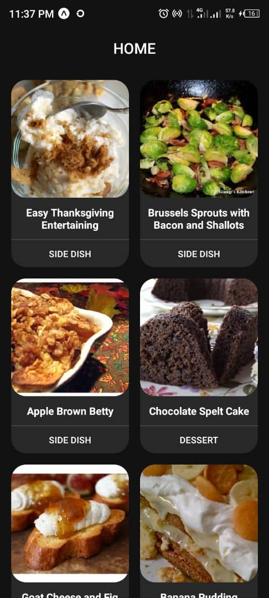
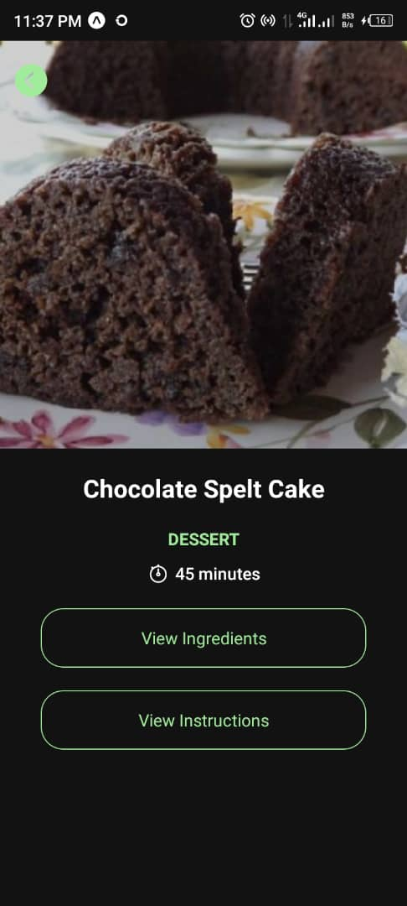
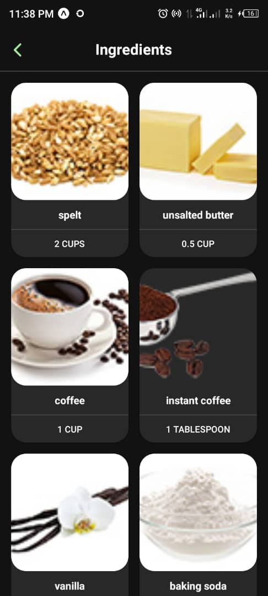
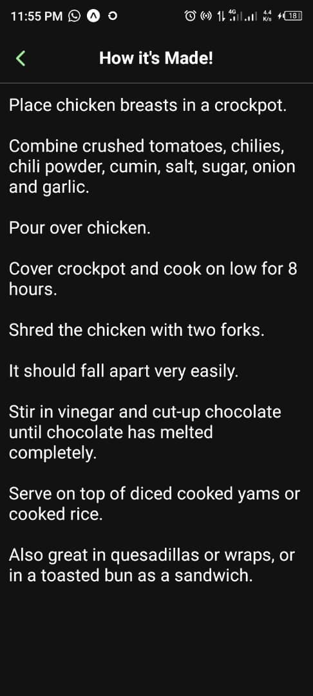

# Simple Recipe App

A lightweight recipe app that helps you find and enjoy delicious recipes!

## Screenshots

<p align="center">
  
  
  
  
  
</p>

## Features
- Browse a variety of simple recipes.
- View detailed instructions and ingredients.

## Installation

1. Clone the repository:
   ```bash
   git clone https://github.com/luwanise/recipe-app.git
   ```
2. Navigate to the project directory:
   ```bash
   cd recipe-app
   ```
3. Install dependencies:
   ```bash
   npm install
   ```
4. Start the app:
   ```bash
   npm start
   ```

## Usage
- Open the app in your browser.
- Explore and search for recipes.

## Technologies Used
- **React** — Frontend framework for building the user interface.

## Contributing
Contributions are welcome! Feel free to fork the repository and submit a pull request.

## License
This project is licensed under the [MIT License](LICENSE).